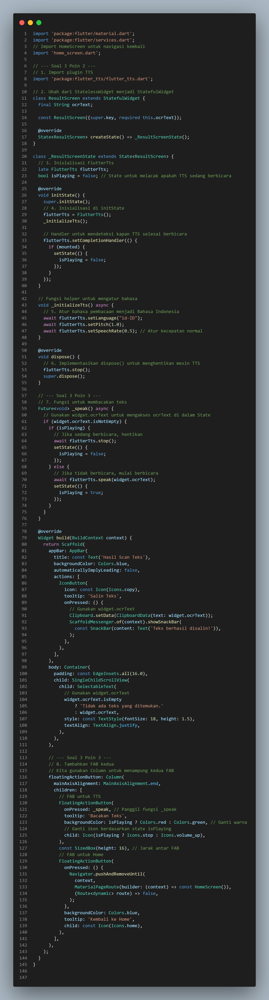

# ocr_sederhana

Dokumentasi Perubahan Fitur untuk UTS (Changelog)

Dokumen ini mencatat perubahan dan implementasi fitur spesifik yang telah ditambahkan ke proyek Aplikasi Pindai Teks (OCR) sesuai dengan poin-poin yang diminta.

1. Perubahan pada lib/screens/home_screen.dart

    Pengubahan Navigasi Home

2. Perubahan pada lib/screens/scan_screen.dart
     Custom Loading Screen di ScanScreen

     Spesifikasi Pesan Error

3. Perubahan pada lib/screens/result_screen.dart

    Teks Utuh dan Navigasi Balik

    Konversi Widget dan Inisialisasi

    Fungsionalitas Pembacaan

4. Perubahan pada pubspec.yaml

    Instalasi Plugin

Hasil Implementasi
1) Home Screen

2) Text saat Loading

3) Jika tidak diberi izin

4) Scan Screen

5) Hasil dan juga terdapat tombol home dan tts

## Getting Started

This project is a starting point for a Flutter application.

A few resources to get you started if this is your first Flutter project:

- [Lab: Write your first Flutter app](https://docs.flutter.dev/get-started/codelab)
- [Cookbook: Useful Flutter samples](https://docs.flutter.dev/cookbook)

For help getting started with Flutter development, view the
[online documentation](https://docs.flutter.dev/), which offers tutorials,
samples, guidance on mobile development, and a full API reference.
